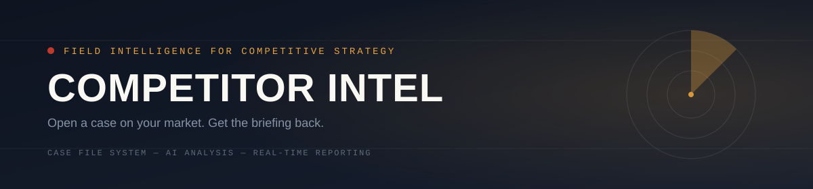

<div align="center">


<div align="center">

# 🔴 COMPETITOR INTEL

### *Field intelligence for competitive strategy*

[](https://competitor-intel-fo3y.onrender.com)
[](https://python.org)
[](https://flask.palletsprojects.com)
[](#license)

</div>

---

**AI-powered competitive intelligence, delivered as a case file.**

Give it your company and up to three competitors — it researches each one, compiles positioning, strengths, weaknesses, and pricing signals, and hands you back a clean, dossier-style briefing. Built to feel like a real SaaS product, not a dev demo.

🔗 **Live demo:** [competitor-intel-fo3y.onrender.com](https://competitor-intel-fo3y.onrender.com)

---

## What it does

1. **Open a case** — enter your company and up to three competitors (name + optional domain)
2. **Investigation runs** — a live progress screen shows exactly what's happening on the backend while an AI model researches each company
3. **Get your briefing** — a full report with:
   - Executive summary
   - Head-to-head competitor profiles (with logos, threat levels, strengths & weaknesses)
   - Visual charts (threat distribution, strengths vs. weaknesses)
   - A comparison matrix across all companies
   - Strategic advice and prioritized recommendations
   - Download as **PDF** or **Word (.docx)**, or copy as plain text

Every past investigation is saved locally in your browser, so you can revisit recent cases without re-running them.

---

## Tech stack

| Layer | Technology |
|---|---|
| Backend | Python, Flask |
| AI analysis | Google Gemini API |
| Frontend | Vanilla HTML / CSS / JavaScript |
| Charts | Chart.js |
| PDF export | fpdf2 |
| DOCX export | python-docx |
| Hosting | Render |

No frontend build step, no framework — deliberately simple so it's easy to read, run, and modify.

---

## Running it locally

**Requirements:** Python 3.10+

```bash
# clone the repo
git clone https://github.com/prathameshkshirsagar532-hue/competitor-intel.git
cd competitor-intel

# install dependencies
pip install -r requirements.txt

# add your Gemini API key
echo "GEMINI_API_KEY=your_key_here" > .env

# run it
python app.py
```

Then open **http://localhost:5000** in your browser.

Get a free Gemini API key at [aistudio.google.com/apikey](https://aistudio.google.com/apikey).

---

## Project structure

```
competitor-intel/
├── app.py                  # Flask app: routes + AI analysis + PDF/DOCX export
├── requirements.txt
├── templates/
│   ├── index.html           # Landing page
│   └── form.html            # Case intake, progress, and report screens
└── static/
    ├── style.css             # Shared design tokens (landing page)
    ├── form.css              # Case flow styling
    └── form.js               # Form logic, AI request handling, report rendering
```

---

## How it works

- The frontend collects a company name and up to three competitors, then calls `/api/analyze`.
- The Flask backend builds a structured prompt and sends it to the Gemini API, requesting a strict JSON response (positioning, strengths, weaknesses, threat level, pricing signal, and a comparison matrix).
- The frontend renders that JSON into the report — profile cards, charts, matrix, and recommendations — entirely client-side.
- `/api/export/pdf` and `/api/export/docx` take the same report data and generate downloadable files on demand.

**A note on accuracy:** the AI answers from its own knowledge rather than live web search, so it's reliable for well-known, real companies but may generate plausible-sounding — and incorrect — details for obscure or fictional ones. Treat the output as a research starting point, not verified fact.

---

## Roadmap / known limitations

- No real-time web search grounding (would require a paid API tier)
- Recent cases are stored per-browser (`localStorage`), not synced across devices
- Free hosting tier spins down after inactivity — first request after idle time may take 30–50s

---

## License

MIT
